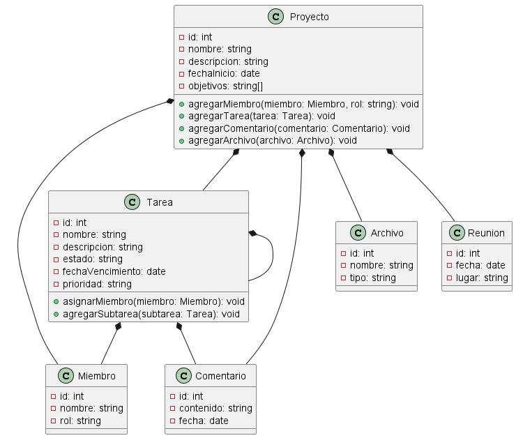
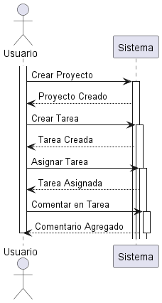
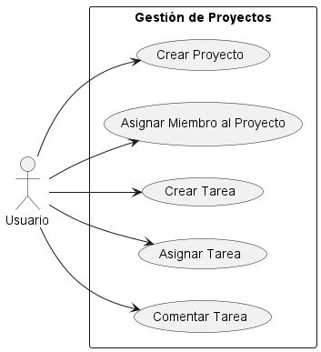

### Diagrama de Clases:

Este diagrama representa las clases en el sistema, incluyendo sus atributos y relaciones.

- **Clases**: Proyecto, Tarea, Miembro, Comentario, Archivo, Reunión.
- **Atributos**: Nombre, Descripción, Fecha de Inicio, Estado, Fecha de Vencimiento, Prioridad, etc.
- **Relaciones**: Asociación (entre Proyecto y Tarea, Proyecto y Miembro), Agregación (entre Proyecto y Comentario, Proyecto y Archivo), etc.

>Ver

### Diagrama de Secuencia:

Este diagrama muestra las interacciones secuenciales entre actores y el sistema en diferentes escenarios.

- **Interacción entre actores**: Usuario, Sistema.
- **Escenarios de interacción**: Creación de Proyecto, Creación de Tarea, Asignación de Tarea, Comentar en Tarea, etc.

>Ver

### Diagrama de Casos de Uso:

Este diagrama describe los casos de uso que los actores pueden realizar en el sistema.

- **Actores**: Usuario.
- **Casos de Uso**: Crear Proyecto, Asignar Miembro al Proyecto, Crear Tarea, Asignar Tarea, Comentar Tarea, etc.

>Ver

